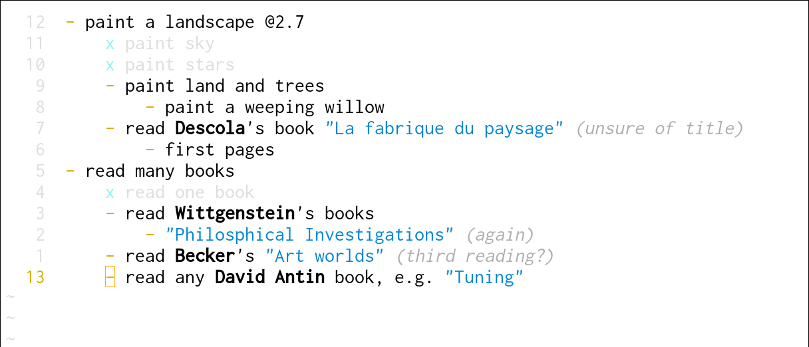
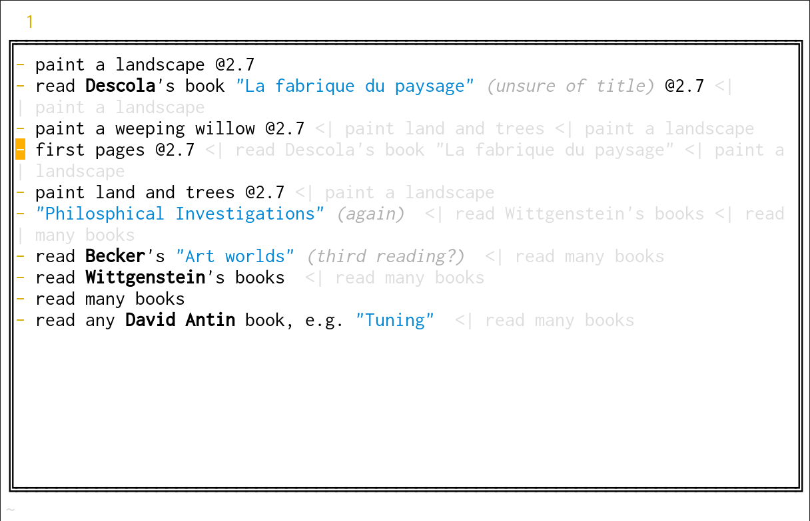

__Tilia__ -- minimal plain-text and hierarchical todolist plugin for Neovim[^1].

[^1]: Why this name, *Tilia*? Just because it's the name of a *tree*, and because its consonants are *tl*, like *todo list* or *task list*.



# Usage

<!-- Image source: https://commons.wikimedia.org/wiki/File:Tilia_x_vulgaris_parklind.jpg -->
 The plugin doesn't do much. It only offers simples functions that toggle tasks (from `-`, incomplete, to `x`, complete, and *vice versa*), and somes functions. Every command are called as subcommands: `:Tilia list ...`, `:Tilia add ...`, etc.

Command __list__ (`:Tilia list <search...>`) is used to show a list of incomplete tasks, sorted by due date and priority, in a floating window. While in the floating window, you can use `<cr>` to jump to the file and line where a task is defined (keymap is configurable, see below). In the floating window, lines order is changed, but hiearchy is still visible:



Due dates are inherited:

```txt
- this task @2.12 has an explicit due date
    - this subtask has no explicit due date: it inherits from its supertask
        - this subsubtask inherits too
```

Arguments can be passed to __list__ to filter searches. If first argument is an exclam sign, the tasks are sorted by priority over due date. If an argument is `not`, then the following argument is a reverse search term. (There is no `or` keyword.)

Command __add__ (`:Tilia add <desc...>`) append a task to a file.

Command __clean__ (`:Tilia clean`) remove all done tasks from the current file.

The keymap __toggle__ toggles from `-` (todo) to `x` (done), and *vice versa*. If the task is currently set to `-` and any subtask isn't done, the function will fail. It avoids situations like:

```txt
x read a lot of books
    - read one book
```

The keymap __do_recursive__ marks as *done* (i.e. `x`) current task and all subtasks, recursively.

# Syntax

Syntax is mostly based on common prose writing practices:
 
- Parentheses are comments, rendered as such.
- Priority is signaled using `!` outside comments and strings. A task's priority is equal to the number of exclams it contains. Thus, for a very high priority task, you can use `- pay rent!!!!!!!!`.
- Negative priority is signaled using `?`, with same logic as `!`.
- Due dates have the format `@d.m.y`. If year is omitted, it's considered to be the current year - `@2.7` is equal to `@02.07.2025`.
- Lines starting with `/` are project headers.

Upon that, there are two other highlighting groups, made for todo lists that implies names and titles, but that has no function:

- Words starting with an uppercase letter are considered names and (by default) rendered in bold.
- Things in double quotes are considered titles and are colorized (by default in blue).
- Words directly preceded by colons, like `:this` are `:tags` (the colon must be preceded by space).

The default folding method is `indent`. Therefore, if you use project, it's convenient to indent each task under the project:

```txt
/ Build a table
    - :buy or find wood
    - borrow tools
    - draw the table
        - :buy paper
        - look at other tables to get ideas
            - buy a table magazine
            - watch a lot of movies :movies
                - look for SF movies with tables :sf
```

# Configuration

You probably want to associate some extension (e.g. `.tilia` or `.todo`) with the plugin and its filetype (`tilia`):

```lua
-- e.g. init.lua
vim.api.nvim_create_autocmd({'BufEnter'}, {
    pattern = "*.todo", 
    command = "setlocal ft=tilia"
})
```

# From command line

To use directly __Tilia__ from command line, just use a bash functions:

```bash
# in ~/.bash_aliases
tl() { nvim -c "Tilia list ${*}"; }
ta() { nvim --headless -c "Tilia add ${*}"; echo; } # Empty echo to add a newline
```

# Dependency

- [lua-iconv](https://github.com/lunarmodules/lua-iconv)

# Configuration

All configuration options are listed in [./lua/tilia/opts.lua](./lua/tilia/opts.lua). You must do changes before calling `setup()` function:

```lua
-- in ~/.config/nvim/init.lua or where you want
local tilia = require "tilia"
tilia.opts.map.new_after = '<cr>'
tilia.opts.map.new_before = '<lf>'
tilia.setup()
```
